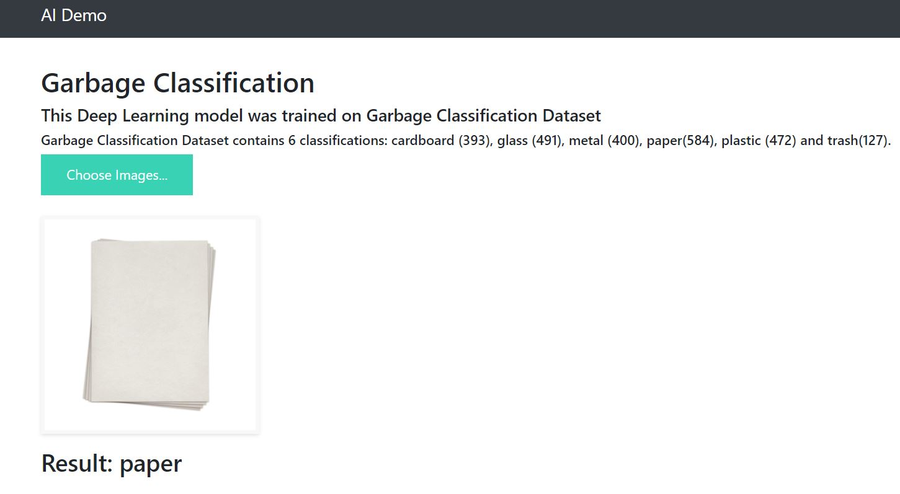
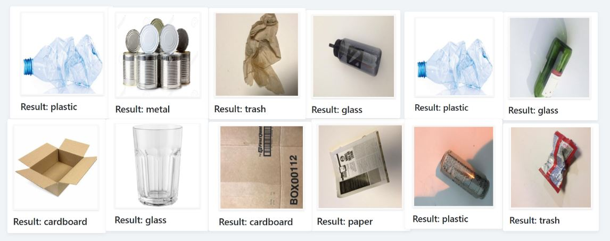

## Garbage Classification - Deep learning - Flask Deployment

### Model: Fine-Tune VGG16
Production Model Performance -> loss: 0.2181 - accuracy: 0.9249 - val_loss: 0.3571 - val_accuracy: 0.8805

## Link to Dataset https://www.kaggle.com/asdasdasasdas/garbage-classification

## Usage

Run app.py using below command to start Flask API
"""
python app.py
"""

### Prediction 

